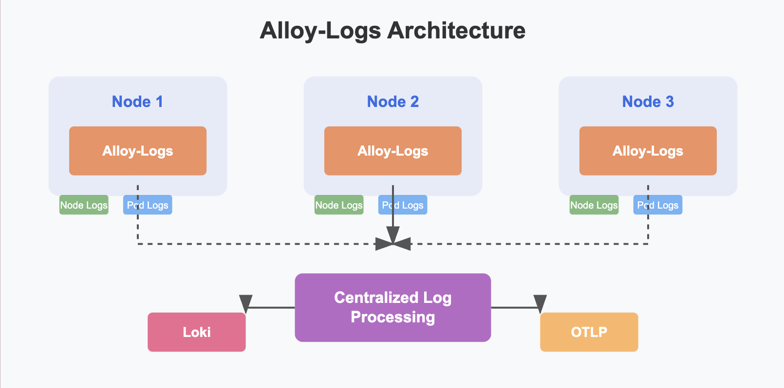

# Grafana K8s Monitoring: A Deep Dive into Alloy-Logs

In our previous [article](https://medium.com/codex/routing-telemetry-in-grafana-k8s-monitoring-a-deep-dive-into-destinations-3a6b7f116ae2), we explored various destinations for telemetry in Kubernetes monitoring with Grafana. Today, we'll focus on Alloy-Logs, a powerful component in the Grafana monitoring stack designed specifically for log collection in Kubernetes environments.

## What is Alloy-Logs?

Alloy-Logs is deployed as a **DaemonSet** (one Pod per node) that collects both **node logs** and **pod logs** (container stdout/stderr by default). It provides **centralized log ingestion** to Loki or any OTLP-logs backend, making it an excellent choice if you don't already run a sidecar/Fluent-bit solution.

Logs require **node-local access**, which is why they're implemented as DaemonSets. This design ensures comprehensive log collection across your entire cluster while minimizing network overhead.



## What Makes Alloy-Logs Unique?

Alloy-Logs offers several key advantages over traditional logging solutions:

1. **Kubernetes-Native Architecture**: Designed specifically for Kubernetes as a DaemonSet, ensuring comprehensive log collection across all nodes.

2. **Unified Observability**: Seamlessly integrates with other Grafana components like Loki and Prometheus for a complete telemetry solution.

3. **Efficient Resource Usage**: Optimized performance with configurable resource limits based on your environment's needs.

4. **Centralized Management**: Supports remote configuration for managing large deployments without constant redeployments.

## Configuration Deep Dive

Let's examine a typical Alloy-Logs configuration:

```yaml
alloy-logs:
  enabled: false
  liveDebugging:
    enabled: true
    
  controller:
    podAnnotations: { }
    volumes:
      extra:
        - name: alloy-log-positions
          hostPath:
            path: /var/alloy-log-storage
            type: DirectoryOrCreate
    tolerations:
      - operator: Exists

  alloy:
    storagePath: /var/lib/alloy
    mounts:
      extra:
        - name: alloy-log-positions
          mountPath: /var/lib/alloy
    resources:
      requests:
        memory: "2048Mi"
        cpu: "500m"
      limits:
        memory: "4096Mi"
        cpu: "1000m"
    extraEnv:
      - name: PLATFORM
        value: minikube
```

### Key Configuration Elements

#### 1. Basic Settings
The `enabled: false` flag indicates that Alloy-Logs is disabled by default. When deploying, you'll need to set this to `true` to activate the functionality.

#### 2. Live Debugging
```yaml
liveDebugging:
  enabled: true
```

Live debugging provides real-time insights into log processing, which is invaluable during troubleshooting sessions. As documented in the [official troubleshooting guide](https://grafana.com/docs/alloy/latest/troubleshoot/debug/), this feature allows you to examine the internal state of Alloy components while they're running. Note that not every component supports live debugging, so check the documentation for compatibility.

#### 3. Controller Configuration
```yaml
controller:
  podAnnotations: { }
  volumes:
    extra:
      - name: alloy-log-positions
        hostPath:
          path: /var/alloy-log-storage
          type: DirectoryOrCreate
  tolerations:
    - operator: Exists
```

The controller is configured as a DaemonSet by default (one pod per node), ensuring comprehensive log collection throughout your cluster. 

The `tolerations` setting is crucial as it allows Alloy-Logs pods to be scheduled on all nodes in your cluster, including those with taints. `Taints` are used in Kubernetes to keep away certain pods from nodes (for example, nodes with specific hardware or reserved for particular workloads). Without these tolerations, your logging solution might miss data from these nodes. While the default `operator: Exists` configuration ensures maximum coverage across all nodes, you can modify these tolerations to be more selective based on your specific requirements.

#### 4. Alloy Core Configuration
```yaml
alloy:
  storagePath: /var/lib/alloy
  mounts:
    extra:
      - name: alloy-log-positions
        mountPath: /var/lib/alloy
  resources:
    requests:
      memory: "2048Mi"
      cpu: "500m"
    limits:
      memory: "4096Mi"
      cpu: "1000m"
```

The storage configuration is essential to understand:
- `storagePath: /var/lib/alloy` defines where Alloy-Logs stores its internal state data, including log positions
- The `mounts` section maps the persistent volume to this path, ensuring that Alloy remembers which logs it has processed even if pods restart

For example, think of this as Alloy's "bookmark" system — it keeps track of where it left off reading logs to avoid duplicate processing or missing data.

Resource allocation is crucial for stable operation. According to the [official resource estimation guide](https://grafana.com/docs/alloy/latest/introduction/estimate-resource-usage/#loki-logs), Alloy-Logs requires sufficient memory and CPU to handle your expected log volume. The configuration above (2GB memory request, 4GB limit) is suitable for medium workloads, but you should adjust based on your specific environment:

- CPU usage typically scales with the number of logs processed per second
- Memory usage depends on the number of active streams and buffering requirements

## Important Additional Parameters

From the comprehensive configuration available, here are some key parameters worth highlighting:

### Logging Configuration
```yaml
logging:
  level: info
  format: logfmt
```
These settings control how Alloy-Logs itself logs its operations, which is crucial for troubleshooting the log collector. The following log levels are available:

* `error`: Only displays error-level logs (least verbose)
* `warn`: Shows warnings and errors
* `info`: Shows informational messages, warnings, and errors (default)
* `debug`: Shows all logs including debug information (most verbose)

### Extra Configuration
```yaml
extraConfig: ""
```
This parameter allows you to add custom Alloy configuration, extending functionality beyond default behaviors. We will discuss more about this in our upcoming articles.

### Remote Configuration
```yaml
remoteConfig:
  enabled: false
  url: ""
  pollFrequency: 5m
```
Remote configuration enables centralized management of logging policies and behaviors. You can control and update these configurations directly from Grafana cloud Fleet management. 

### Config Reloader
```yaml
configReloader:
  enabled: false
```

**Tip**: By default, Alloy-Logs pods come with a Prometheus config reloader that checks for changes in ConfigMaps and Secrets. If you already use a cluster-wide reloader like [Stakater Reloader](https://github.com/stakater/Reloader), you can disable this component to save resources. This is particularly useful in large clusters where every resource optimization counts.

---

## Challenges and Limitations

While Alloy-Logs provides powerful capabilities, it's important to acknowledge some challenges you might encounter:

### 1. Limited Testing Capabilities for Transformations

Unlike Elasticsearch, which offers an ingest pipeline simulator API ([Elasticsearch Ingest Simulate API](https://www.elastic.co/docs/api/doc/elasticsearch/operation/operation-ingest-simulate)), Grafana Alloy-Logs lacks a built-in mechanism to test log transformations before deploying them to production. This makes it difficult to validate complex transformations without risking impact to your live environment.

To overcome this limitation, you'll need to build a test environment. One approach is to create a small Loki collector setup for testing purposes. For those interested in this approach, a helpful testing lab is available at [grafana-observability-test-lab](https://github.com/varunpappu/grafana-observability-test-lab).

### 2. Live Debugging Limitations

While live debugging is available, it has significant limitations in high-volume environments:

- The interface can become overwhelming with too many signals, making it easy to lose track of what you're investigating
- The feature is still relatively immature compared to debugging tools available in more established logging platforms

These limitations mean that troubleshooting complex issues in production environments can be challenging, often requiring additional logging or external tools to supplement Alloy-Logs' built-in capabilities.

### 3. Limited Flexibility for Custom Pipelines

Grafana Alloy-Logs does not currently support Fluent Bit or Logstash-style **multistage pipeline orchestration**, which restricts teams from defining flexible, modular log processing workflows via their own ConfigMaps.

In tools like Fluent Bit and Logstash, it's common to create custom configuration files that define distinct processing stages—such as parsing, filtering, transforming, and routing—each configured independently and applied sequentially. This gives teams full control over how logs are processed and routed, and allows them to reuse and update logic without touching core deployment manifests.

With Alloy-Logs:

- You can’t easily define **custom, team-owned processing stages** using ConfigMaps
- Complex workflows like **conditional parsing**, **enrichment**, or **multi-destination routing** become harder to model
- Centralized control and reusability of log pipelines are reduced, especially in large multi-team clusters

This can be a significant limitation in environments where teams need to customize log pipelines independently or manage their own observability policies.


## Looking Forward: podLogs and nodeLogs

In our next article, we'll explore two core features of Alloy-Logs that provide comprehensive observability:

### podLogs
The podLogs feature collects all container standard output and standard error streams across your Kubernetes cluster, providing application-level visibility without requiring changes to your applications.

### nodeLogs
The nodeLogs feature collects system logs from each node, giving you infrastructure-level insights. This is critical for diagnosing issues that may originate at the node level rather than within containers.

These features together create a complete logging solution that captures telemetry at both the application and infrastructure levels.

## Conclusion

Alloy-Logs provides a powerful solution for log collection in Kubernetes environments. Its DaemonSet architecture ensures comprehensive coverage, while its integration with the broader Grafana stack creates a unified observability experience. By understanding the configuration options and both the strengths and limitations of Alloy-Logs, you can make informed decisions about implementing it in your environment.


You can find the complete values.yaml configuration [here](https://github.com/varunpappu/articles/blob/main/grafana-k8s-monitoring/alloy-logs/introduction/values.yaml).

In our next article, we'll explore the podLogs and nodeLogs features in detail, showing how they can be configured and optimized for different scenarios.